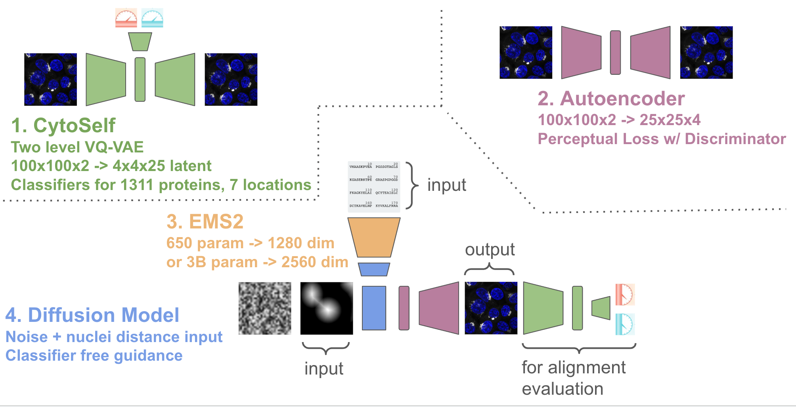
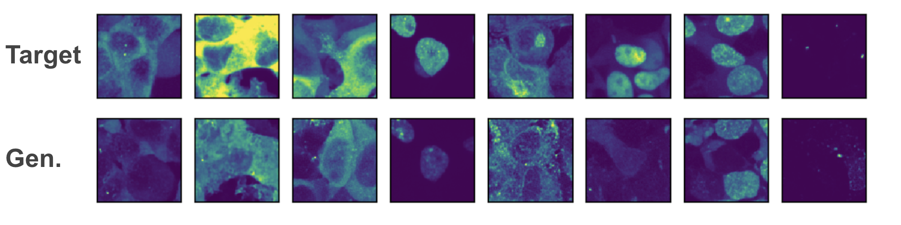
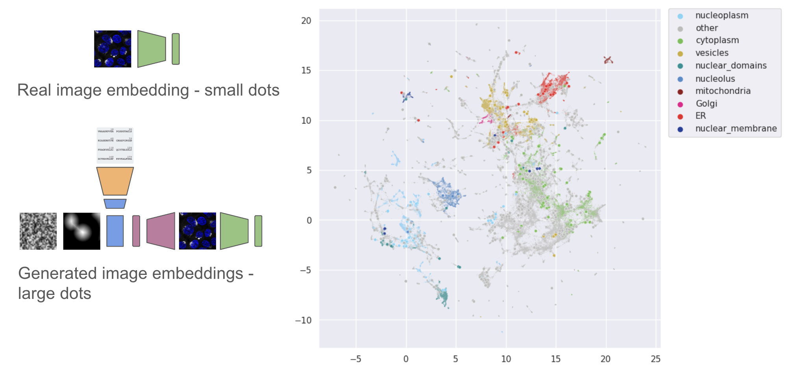
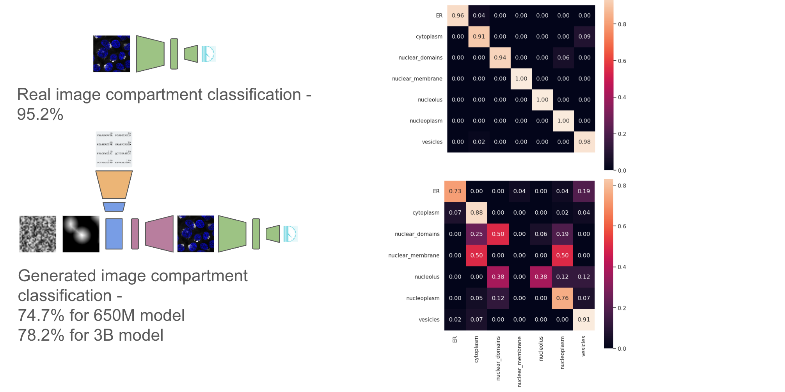
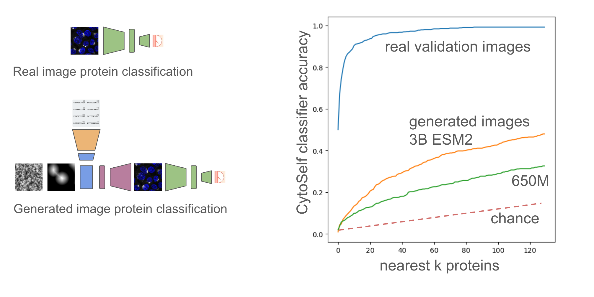

# proteoscope: a “virtual microscope” powered by a protein language model and image diffusion

*Status: exploratory project, under open development & unpublished. All code may undergo breaking changes, and any insights or results are subject to change as more work is done - this is open science! If you have any questions/ comments open an issue.*

# image diffusion conditioned on protein sequence

Image diffusion conditioned on natural language has allowed the creation of striking examples of complex and imaginative scenes from simple text prompts (e.g. [stable diffusion](https://github.com/Stability-AI/stablediffusion)). Diffusion methods have begun to be applied within biology to problems like protein structure generation (e.g. [rf-diffusion](https://github.com/RosettaCommons/RFdiffusion)). In this work, we explore whether image based diffusion models can be conditioned on protein sequences to generate photorealistic images of the subcellular distribution of proteins.

The ability to accurately generate images of protein subcellular localization from sequence could shed light on the function and interactivity of proteins as information about protein complex formation can be inferred from images alone (see [cytoself](https://www.nature.com/articles/s41592-022-01541-z)). Furthermore such a model could allow for investigation of how sequence motifs and mutations might drive and affect protein trafficking. Protein sequence to subcellular localization models are often studied at the level of subcellular compartments (e.g. [deeploc2](https://academic.oup.com/nar/article/50/W1/W228/6576357)), though see [CELL-E](https://www.biorxiv.org/content/10.1101/2022.05.27.493774v1) which took a transformer based approach to sequence to image generation.

### data

As in CELL-E, we make use of [OpenCell](https://opencell.czbiohub.org/) data which contains subcellular localization images of just over 1000 proteins. We use data crops available from [cytoself](https://github.com/royerlab/cytoself/tree/main#data-availability) which results in over 1M multichannel images of protein and nucleus from about 20k fields of view. We split our protein sequences into 80% training, 10% validation, and 10% test according to field of view. Each image crop is 100 pixels x 100 pixels (which is about 40 microns x 40 microns). In addition to the nuclear image we use a nuclear distance map which contains a normalized distance of every pixel to the nuclear border. We will do data augmentation with 90° rotations and flips.

### architecture and evaluation

Overall proteoscope uses four major modeling components, as depicted in the image below:

To evaluate performance of the model we leverage a pre-trained [cytoself](https://github.com/royerlab/cytoself) model (1.), which includes a classifier that maps images to protein sequence. Note cytoself was also trained on our validation and test sequences, so we can use it to evaluate diffusion performance for these sequences too. We take our generated images and pass them through cytoself and then compare the cytoself classifications and distances in the cytoself latent space. These losses act like the perceputal losses often used in computer vision, but leveraging a model trained on protein images, rather than natural images.

We also train a simple subcellular localization classifier from the cytoself latent space to look at if the generated images have the right subcellular localization at the organelle level.

We follow the [latent diffusion](https://github.com/CompVis/latent-diffusion) approach made popular by stable diffusion, by first training an autoencoder (2.) on images from our training sequence. Following the original implementation, we use a loss that includes a perceptual component and a discriminator.

We then perform diffusion in the latent space of the autoencoder using the [UNet2DConditionModel](https://huggingface.co/docs/diffusers/api/models/unet2d-cond) from the huggingface diffusers library (4.). To condition on protein sequence, we pass the protein sequence through a pre-trained protein language model [ESM2](https://github.com/facebookresearch/esm) (3.) and extract embeddings from the last layer. We also condition on a spatially downsampled image of the nuclear distance. The nuclear distance image allows us to generate protein localizations relative to the nucleus, but without having to worry about flourescent bleed through of the protein channel that can occur when using the actual nuclear image.

## results (in progress)

Preliminary results indicate that it is possible to generate beuatiful images of localizations from the train protein sequences, but that overfitting to those sequences is a significant concern when looking at generations from the validation set.

Random selection of images from eight proteins from the validation set. Top row real image, bottom row diffused image. You can see 
some good matches, but also some misses (like 6th column).

We can also compare the embedding locations of real vs generated images in the cytoself latent space. Generally embeddings from the generated images are close to embeddings of the real target images.

Along with compartment level classifications from the validation set

Finally we can look at image level classifications from the validation set for the k-nearest neighboring proteins across the whole set (1311 proteins). We can do this for both the 650M and 3B parameter models of ESM2, and we can clearly see much better generalization from the embeddings from the 3B parameter model. Performance on this task could therefore be a useful indicator of the generalizability of protein embeddings.

## preliminary conclusions and potential next steps

- Images look like real microscope images, but alignment needs work. Using 3B vs 650M ESM2 model helps.
- Currently trying LORA on ESM2 with a localisation classification task. Considering CLIP-like approach, but maybe not enough sequences.
- Want to do more scaling analysis of performance vs number of training protein sequences and size of the model.
- Can we perform some protein sequence augmentation?
- Can we incorporate additional protein information, such as an embedding of text describing the protein from a general LLM or an embedding the protein name from an LLM that has seen the scientific literature?

## acknowledgements

Nicholas Sofroniew and is supported by the Chan Zuckberberg Initative. Thanks to Tom Hayes for invaluable conversations on model architectures and overall approach.
